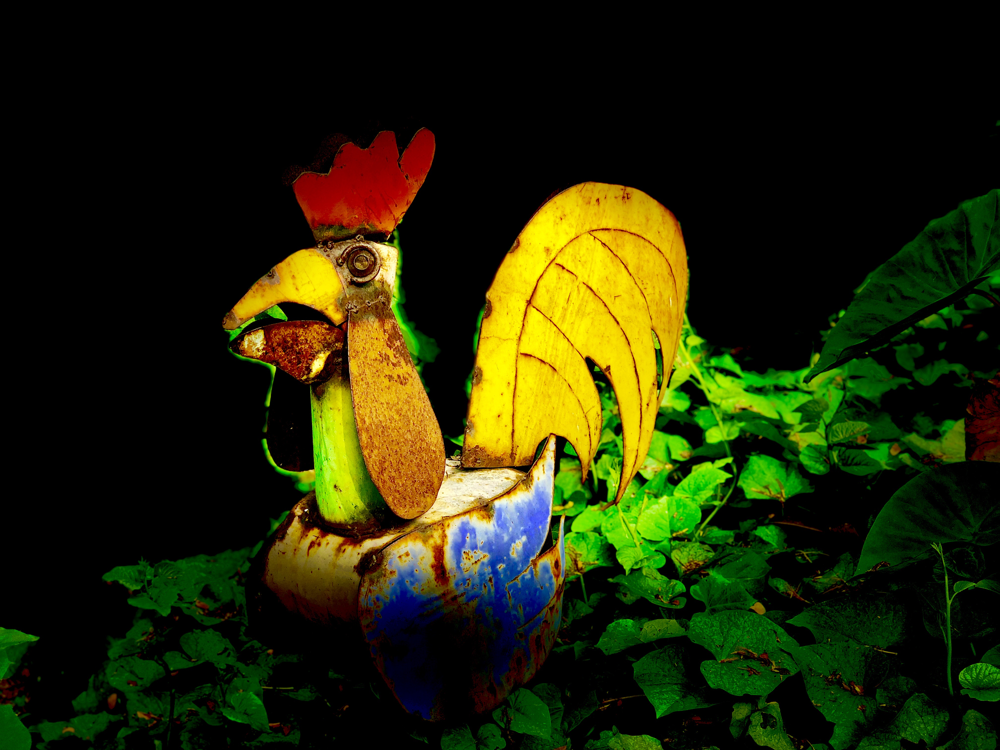

# hello world!

## About Me
Hello! My name is **Andrew Pan** and I'm a junior at UC San Diego majoring in *Computer Science and Cognitive Science*.
See [below](#favorite-classes-so-far) for my favorite classes thus far. 

## Favorite Quote
> "You miss 100 percent of the shots you don't take." ~Wayne Gretzky  

## Most Used Programming Language Currently
Python! I'm using it in CSE 150B and COGS 108 right now. Here's a small code snippet:
```
print("Python is great! I love its simple syntax.")
```

## Hobbies
- Tennis
- Piano
- YouTube! Here's one of my favorite [videos](https://youtu.be/zR3Igc3Rhfg)
- Photography! Here's a [picture](leaves.jpeg) I took of cool leaves. And here's another picture:
     

## Favorite Classes so Far
1. CSE 100
2. COGS 18
3. CSE 15L
4. ~~ECE35~~ 

## CSE 110 Lab 1 Task List
- [x] Headings
- [x] Styling text
- [x] Quoting text
- [x] Quoting code
- [x] External Links
- [x] Section links
- [x] Relative links (Link to another .md file or an image in your repo. If linking to an image, encode it as a regular link rather than an image.)
- [x] Ordered and Unordered Lists